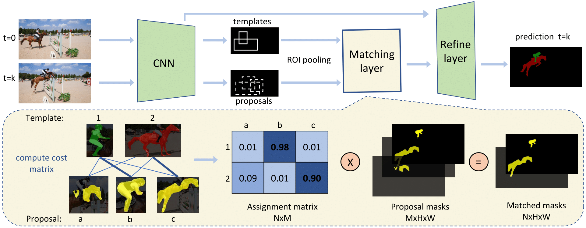

# DMM-Net: Differentiable Mask-Matching Network for Video Object Segmentation (ICCV 2019)

## Overview


### Requirements:
- PyTorch 1.1.0 
- torchvision 
- cocoapi
- matplotlib
- maskrnn-benchmark

## Installation 
- Follow [INSTALL.md](INSTALL.md)

## Data

### YouTube-VOS

- Download the YouTube-VOS dataset from their [website](https://youtube-vos.org/dataset/vos/). 
Please note that our code is trained and tested only on YouTube-VOS dataset for 2018 version. There is a newer version released 2019 but it is not tested. 

- We recommend to symlink the path to the youtube dataset to datasets/ as follows
```
cd datasets 
ln -s path/to/youtubeVOS youtubeVOS 
```

- The files structure should look like:
```
DMM/datasets 
       ├── youtubeVOS
       │       ├── train 
       │       │      ├── JPEGImages
       │       │      │        ├── ... 
       │       │      ├── Annotations 
       │       │      │        ├── ... 
       │       ├── valid 
       │       │      ├── JPEGImages
       │       │      │        ├── ... 
       │       │      ├── Annotations 
       │       │      │        ├── ... 
       │       ├── train_testdev_ot (optional)
       │       │      ├── JPEGImages
       │       │      │        ├── ... 
       │       │      ├── Annotations 
       │       │      │        ├── ... 
```

## Prepare proposals 

### Option1: Download the extracted file

#### for evaluation
- To eval DMMnet on youtubeVOS with the fine-tuned proposal net, use the propsoals generated by our fine-tuned Mask R-CNN model:
    - [proposals-train-val](https://hkustconnect-my.sharepoint.com/:u:/g/personal/xzengaf_connect_ust_hk/Ect7TbZR_kVPjsUcW0UpswwBIzvEi0ziXcva_6iuCYBk1Q?e=4uefON)

#### for training 
- To train the DMMnet on youtubeVOS train-train split, need to prepare 1. proposals for both train-train and train-val split extracted by coco pretrained X101 Mask R-CNN model 
- proposals can be downloaded: 
    - [proposals_coco81 (train-train, train-val and testdev-online-training)](http://www.cs.toronto.edu/~xiaohui/feature_coco81.tar.gz)

- extract the proposals and place it as `experiments/proposals/coco81`

- preprocess the proposals for training DMM: 
```
python src/tools/reduce_pth_size_by_videos.py  experiments/proposals/coco81/inference/youtubevos_train3k_meta/predictions.pth  train 50
python src/tools/reduce_pth_size_by_videos.py  experiments/proposals/coco81/inference/youtubevos_val200_meta/predictions.pth  trainval 50
python src/tools/reduce_pth_size_by_videos.py  experiments/proposals/coco81/inference/youtubevos_testdev_online_meta/predictions.pth  train_testdev_ot 90 
```

- The files structure should look like:
```
DMM/experiments
       ├── models
       │       ├── propnet
       │       │     ├── join_ytb_bin
       │       │     │       ├── model_0172500.pth 
       │       │     ├── online_ytb
       │       │     │       ├── model_0225000.pth 
       │       ├── dmmnet 
       │       │     ├── ytb_train
       │       │     │       ├── epo08 
       │       │     ├── online_ytb
       │       │     │       ├── epo101 
       ├── proposals 
       │       ├── coco81 
       │       │     ├── inference
       │       │     │       ├── youtubevos_train3k_meta (optional)
       │       │     │       ├── youtubevos_val200_meta
       │       │     │       ├── youtubevos_testdev_online_meta (optional)
       │       ├── ytb_train 
       │       │     ├── inference
       │       │     │       ├── youtubevos_val200_meta
       │       ├── ytb_ot 
       │       │     ├── inference
       │       │     │       ├── youtubevos_testdev_meta
```

### Option2: extract the proposals 
- The model trained on youtubeVOS dataset can be found in [MODEL_ZOO.md](./MODEL_ZOO.md)
- The scripts used to extract proposals from the trained model can be found in [scripts/extract/](./scripts/extract)

## Training
- Train DMMnet on youtubeVOS: 
```
sh scripts/train/train_load_prop.sh
```

### Online training
Train DMMnet on the first frame of validation set, 

- first download the preprocessed data used for online training from [here](https://hkustconnect-my.sharepoint.com/:u:/g/personal/xzengaf_connect_ust_hk/ETsB6vt5U51Npzwcamb67YMBKPjC4tl5ONBilpFPTmsQyA?e=QN1VjA), extract the data and put/link the extracted folder as `/PATH/TO/datasets/youtubeVOS/train_testdev_ot`

- prepare proposal, check the Section: Prepare proposals - for training 

- get the DMMnet trained on train-train set for 1 epoch from [here](https://hkustconnect-my.sharepoint.com/:u:/g/personal/xzengaf_connect_ust_hk/ESmFqlodogNLrEIMt0ve84IBAOVokxY5HTDG3YMVQ5dzbg?e=6K4VY2) and put it under `experiments/dmmnet/` 

- start online training 
```
sh scripts/train/train_online.sh # it takes ~0.17h for one epoch
```

## Evaluation
- Evaluate DMMnet on trainval split: 
    - will need the trained model and the [extracted train-val proposal](https://hkustconnect-my.sharepoint.com/:u:/g/personal/xzengaf_connect_ust_hk/Ect7TbZR_kVPjsUcW0UpswwBIzvEi0ziXcva_6iuCYBk1Q?e=4uefON) 
    - run `sh scripts/eval/eval_r50.sh` 
    - compute the J and F score by `sh scripts/metric/full_eval.sh /PATH/TO/OUTPUT/merged/`
    expected results:
    
| Method   |   J_mean |   J_recall |   J_decay |   F_mean |   F_recall |   F_decay |
|-------------|----------|------------|-----------|----------|------------|-----------|
| ytb_R50_w_match_loss_epo13 [download_model](https://hkustconnect-my.sharepoint.com/:u:/g/personal/xzengaf_connect_ust_hk/ERgj1R97zEFAm1RC-8fsw1wBcP3Lre4zI-ArDiDdmEjBYA?e=SIqAqZ) |    0.612 |      0.703 |     0.108 |    0.748 |      0.826 |     0.114 |
| ytb_R50_wo_match_loss_epo08 [download_model](https://hkustconnect-my.sharepoint.com/:u:/g/personal/xzengaf_connect_ust_hk/ERQB9zbqRLxFvjTkEZgWSsoBswr2Xxvk6vQqnx8S7TPjqg?e=QyIEG3) |      0.6 |      0.684 |     0.104 |    0.742 |      0.819 |     0.109 |

- Evaluate online-trained DMMnet:
    - Download [proposals extracted by online-trained proposal net](https://hkustconnect-my.sharepoint.com/:u:/g/personal/xzengaf_connect_ust_hk/ERBrgLZkIsxPuEeLogoq0lABvo4kGlKlyTcA-J_YVtDyAw?e=3vvcnG) and the [model](https://hkustconnect-my.sharepoint.com/:u:/g/personal/xzengaf_connect_ust_hk/Ea90kmgxdzRIs1LcGYoNilEBvxTFYbjO-e62x3inbmTbWw?e=goowfI)
    - run `scripts/eval/eval_testdev.sh`
    - prepare the submission data with `scripts/submit.sh` and submit to [the server](https://competitions.codalab.org/competitions/19544#learn_the_details), expected resules: G mean = 0.579
    
-----------
part of the code is from https://github.com/imatge-upc/rvos
